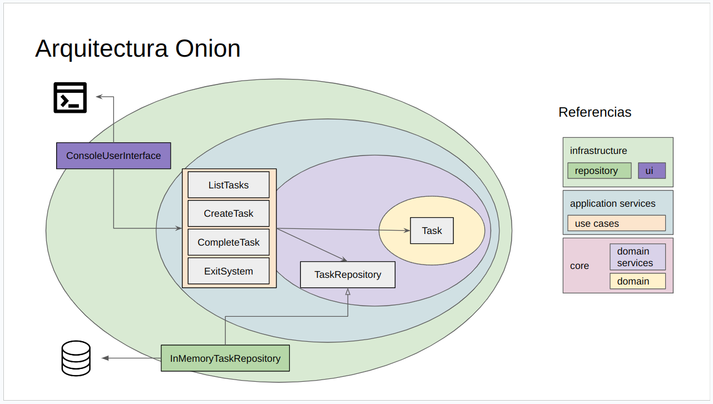

# µ-TODO con arquitectura onion
Se ilustra en este ejemplo la arquitectura onion.

## Componentes
- 00_core
  - domain
  - services
- 01_application_services
  - use_cases
- 02_infrastructure
  - repository
  - user_interface

## Diagrama

