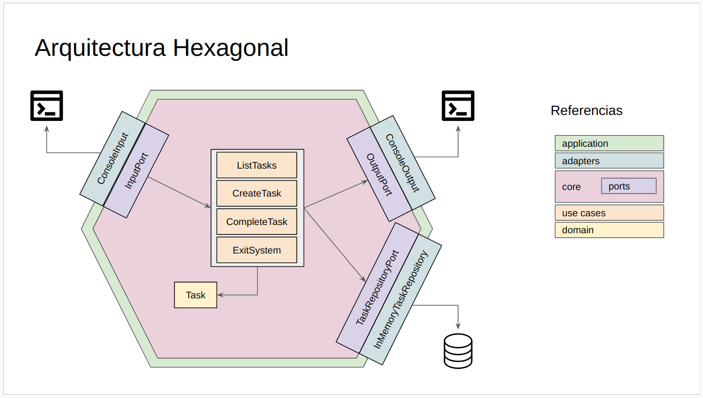

# µ-TODO con arquitectura hexagonal
Se ilustra en este ejemplo la arquitectura hexagonal.

## Componentes
- application
- core
  - domain
  - ports
  - use_cases
- infrastructure
  - adapters
  - repositories

## Diagrama

