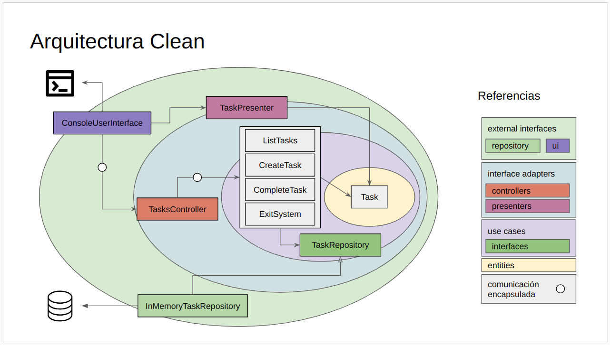

# µ-TODO con arquitectura clean
Se ilustra en este ejemplo la arquitectura clean.

## Componentes
- 00_entities
- 01_use_cases
  - interfaces
- 02_interface_adapters
  - controllers
  - presenters
- 03_external_interfaces
  - repository
  - user_interface
- 04_application

## Diagrama

